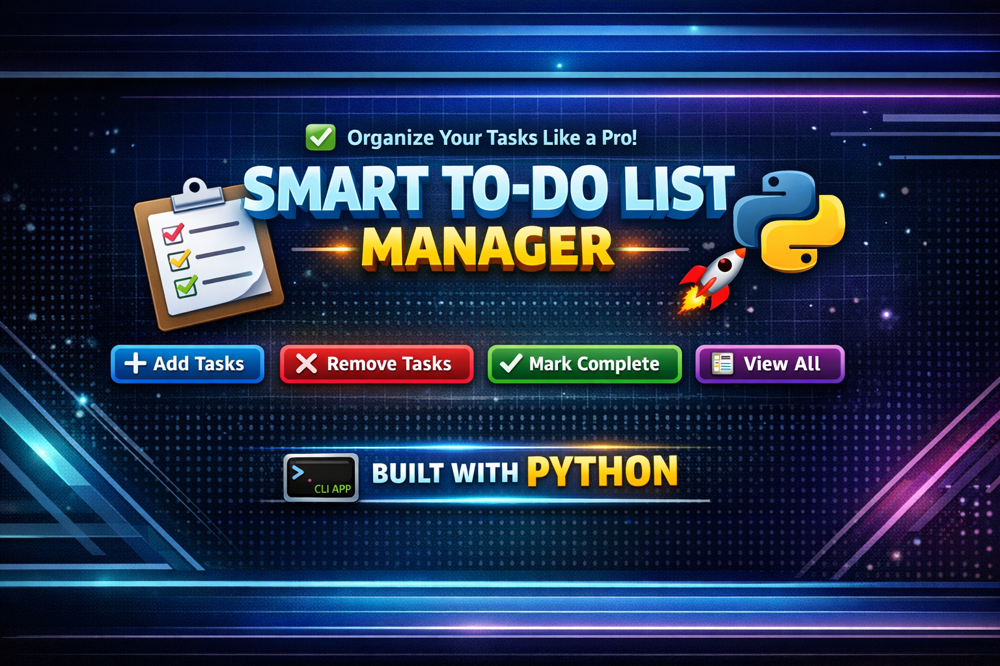

<p align="center">
  
</p>

# 📝 Smart To-Do List Manager

<p align="center">
  🚀 A clean and interactive Command Line To-Do List App built with Python 🐍
</p>

<p align="center">
  <a href="https://github.com/rishii-in/To_do_list_python">
    
  </a>
  
  
  
</p>

---

## 📌 Project Overview

The **Smart To-Do List Manager** is a simple yet powerful CLI-based application that helps users manage daily tasks efficiently.
It is built using core Python concepts like lists, loops, and conditional statements.

🔗 **Repository Link:**
👉 https://github.com/rishii-in/To_do_list_python

---

## ✨ Features

✔️ ➕ Add new tasks
✔️ ❌ Remove tasks
✔️ 📋 View all tasks
✔️ ✅ Mark tasks as completed
✔️ 🎉 Track completed tasks separately
✔️ 🧠 Beginner-friendly logic

---

## 🧠 Concepts Used

* 📌 Python Lists
* 🔁 Loops (`while`, `for`)
* 🔀 Conditional Statements (`if-else`)
* 🔍 Searching (`in`, `index`)

---

## 📂 Project Structure

```
To_do_list_python/
│
├── main.py
├── README.md
└── banner.png
```

---

## ▶️ How to Run

```bash
# Clone the repository
git clone https://github.com/rishii-in/To_do_list_python.git

# Navigate to the project folder
cd To_do_list_python

# Run the program
python main.py
```

---

## 🎯 Learning Outcomes

🚀 Strengthened problem-solving skills
📚 Mastered Python list operations
💡 Built a real-world CLI application
🧩 Improved logical thinking

---

## 🔥 Future Enhancements

* 💾 Save tasks to file (File Handling)
* 🎨 Add colored CLI output
* 🖥️ Convert into GUI using Tkinter
* 🌐 Convert into Web Application

---

## 🤝 Contributing

Contributions are welcome!
Feel free to fork this repository and improve it 🚀

---

## ⭐ Support

If you like this project:

🌟 Star this repository
🍴 Fork it
📢 Share it with others

---

## 👨‍💻 Author

**Rishi**
💻 Python Learner | Future Developer 🚀

---

<p align="center">
  💡 <i>"Code. Learn. Build. Repeat."</i>
</p>
